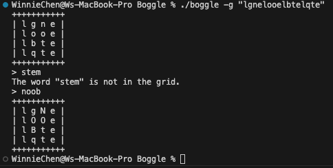

# Boggle
## Describtion
Boggle is a game that is made up of a grid of arranged letters among ‘abcdefghijklmnopqrstuvwxyz’. The
goal is to find words within this grid. In order to validate a word, the letters must be side to side to one
another.
A letter cannot be used more than once in a word.
Your program must look for a word, entered on the standart input, within such a grid. If found, the grid must
be displayed with the word in capital letters; otherwise, an error message must be displayed.

## Usage: `./boggle -g GRID [-s SIZE] [-w WORD]`
* `-s` SIZE defines the size of a side of the grid (def: 4)
* `-g` GRID specifies a hard-coded grid (MANDATORY). If the grid does not contain the
correct number of characters, you must display an error.
* `-w` WORD force the word to be looked for.

## Requirements
* binary name: boggle
* language: C
* compilation: via Makefile, including re, clean and fclean rules
> * The totality of your source files, except all useless files (binary, temp files, obj
files,...), must be included in your delivery.
> * Error messages have to be written on the error output, and the program should
then exit with the 84 error code (0 if there is no error).

> For this project, the only authorized functions are those of the standard libC.

## Idea
### Searching
For the searching part, I used Depth-First Search (DFS) to determine if the word exists in the grid.

* Searching steps

## Result
### Build

### Interactive mode

### Entered word by using `-w` arguments

### Entered word by using standard input

### Error message
